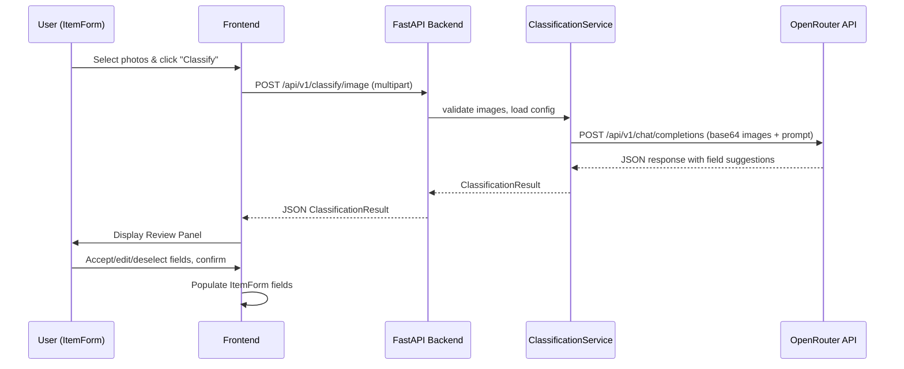
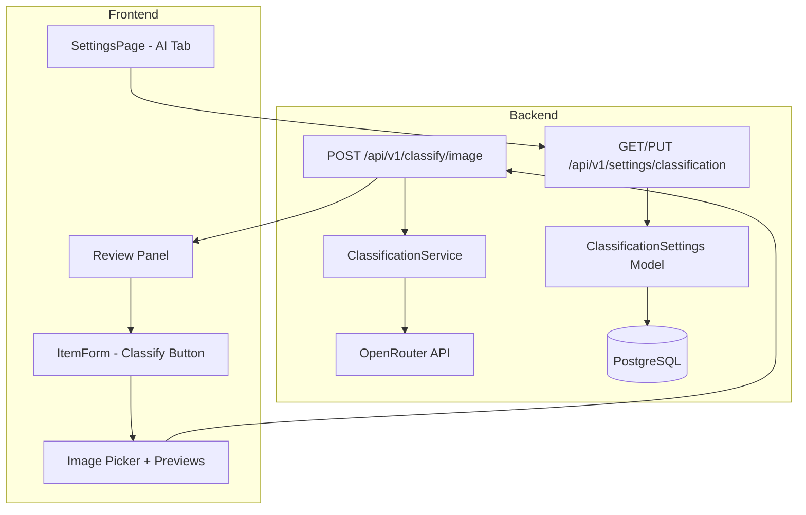

# Design Document: Auto-Classification

## Overview

The Auto-Classification feature adds LLM-powered image classification to the inventory system. Users photograph items during creation, and the system sends images to an OpenRouter-compatible LLM to infer item fields (name, type, brand, model number, etc.). Results are presented in a review panel for user confirmation before populating the ItemForm.

The feature spans three layers:
1. A new backend `ClassificationService` and `/api/v1/classify/image` endpoint that proxies images to OpenRouter
2. A new `ClassificationSettings` database model and `/api/v1/settings/classification` CRUD endpoints for persisting encrypted API credentials
3. Frontend additions to ItemForm (photo capture + review panel) and SettingsPage (AI Configuration tab)

The system uses `httpx` (already a test dependency) for async HTTP calls to OpenRouter, and the existing `security.py` encryption pattern (Fernet via `secret_key`) for API key storage at rest.

## Architecture





## Components and Interfaces

### Backend Components

#### 1. ClassificationSettings Model (`backend/app/models/classification_settings.py`)

A singleton database row storing the OpenRouter configuration. Uses the existing `Base` and `UUIDMixin` from `app.models.base`.

- `id`: UUID primary key
- `api_key_encrypted`: Text, nullable — Fernet-encrypted OpenRouter API key
- `model_identifier`: String(255), default `"google/gemini-2.5-flash-lite"`
- `updated_at`: DateTime with timezone

#### 2. ClassificationService (`backend/app/services/classification_service.py`)

Core service with these functions:

- `get_settings(db) -> ClassificationSettings | None` — Load singleton config row
- `save_settings(db, api_key: str | None, model_identifier: str) -> ClassificationSettings` — Upsert config, encrypt API key using Fernet with `settings.secret_key`
- `classify_images(db, files: list[UploadFile]) -> ClassificationResult` — Validate files, encode to base64, build OpenRouter chat completion request, parse structured response
- `_build_prompt() -> str` — Returns the system prompt instructing the LLM on output format and constraints
- `_encrypt_api_key(key: str) -> str` — Fernet encrypt
- `_decrypt_api_key(encrypted: str) -> str` — Fernet decrypt

#### 3. Classification API Router (`backend/app/api/v1/classify.py`)

Two endpoint groups:

**Classification endpoint:**
- `POST /api/v1/classify/image` — Accepts `List[UploadFile]` (field name: `files`), requires Admin/Editor role. Validates file count (≤5), individual size (≤10MB), total size (≤30MB), MIME types. Returns `ClassificationResultResponse`.

**Settings endpoints:**
- `GET /api/v1/settings/classification` — Returns model identifier and `has_api_key: bool`. Requires Admin role.
- `PUT /api/v1/settings/classification` — Accepts `ClassificationSettingsUpdate` body. Requires Admin role.

#### 4. Pydantic Schemas (`backend/app/schemas/classification.py`)

```python
class ClassificationField(BaseModel):
    field_name: Literal[
        "name", "description", "item_type", "brand",
        "model_number", "part_number", "condition", "is_consumable"
    ]
    value: str
    confidence: Literal["high", "medium", "low"]

class ClassificationResult(BaseModel):
    fields: list[ClassificationField]

class ClassificationSettingsRead(BaseModel):
    model_identifier: str
    has_api_key: bool

class ClassificationSettingsUpdate(BaseModel):
    api_key: str | None = None
    model_identifier: str = "google/gemini-2.5-flash-lite"
```

### Frontend Components

#### 1. ClassifyButton + ImagePicker (in ItemForm)

Added to the "Basic Information" card when `isEdit === false`:
- "Classify from Photos" button, disabled when no API key is configured (checked via `GET /api/v1/settings/classification`)
- Opens a multi-file picker accepting `image/jpeg, image/png, image/webp`
- Shows thumbnail previews with remove buttons
- "Add more" button to append images without replacing
- Submits to `POST /api/v1/classify/image` as `multipart/form-data`

#### 2. ReviewPanel Component (`frontend/src/components/ReviewPanel.tsx`)

A dialog/sheet overlay displaying classification results:
- Each field shown with name, value (editable input), confidence badge (color-coded)
- Checkbox per field to include/exclude from application
- "Apply" button populates ItemForm fields, preserving non-classified fields
- "Discard" button closes without changes
- Empty result state shows "Could not classify" message

#### 3. AI Classification Settings Section (in SettingsPage Preferences tab)

New section within the existing Preferences tab:
- API Key input (type="password", masked)
- Model identifier input with default placeholder
- Save button that calls `PUT /api/v1/settings/classification`
- Status indicator showing whether API key is configured

### API Interface Summary

| Method | Path | Auth | Request | Response |
|--------|------|------|---------|----------|
| POST | `/api/v1/classify/image` | Admin/Editor | `multipart: files[]` | `ClassificationResult` |
| GET | `/api/v1/settings/classification` | Admin | — | `ClassificationSettingsRead` |
| PUT | `/api/v1/settings/classification` | Admin | `ClassificationSettingsUpdate` | `ClassificationSettingsRead` |

## Data Models

### ClassificationSettings Table

```sql
CREATE TABLE classification_settings (
    id UUID PRIMARY KEY DEFAULT gen_random_uuid(),
    api_key_encrypted TEXT,
    model_identifier VARCHAR(255) NOT NULL DEFAULT 'google/gemini-2.5-flash-lite',
    updated_at TIMESTAMPTZ NOT NULL DEFAULT now()
);
```

This is a singleton table (at most one row). The service upserts by checking for an existing row.

### ClassificationResult (transient, not persisted)

```json
{
  "fields": [
    {
      "field_name": "name",
      "value": "DeWalt DCD771C2 Drill/Driver",
      "confidence": "high"
    },
    {
      "field_name": "brand",
      "value": "DeWalt",
      "confidence": "high"
    },
    {
      "field_name": "item_type",
      "value": "Tool",
      "confidence": "high"
    },
    {
      "field_name": "condition",
      "value": "Available",
      "confidence": "medium"
    }
  ]
}
```

### Encryption Approach

The API key is encrypted at rest using Fernet symmetric encryption derived from the application's `secret_key` (from `app.core.config.settings`). The key is padded/hashed to 32 bytes for use as a Fernet key. This follows the same trust model as JWT signing — if `secret_key` is compromised, stored API keys are also compromised.

```python
from cryptography.fernet import Fernet
import base64, hashlib

def _get_fernet() -> Fernet:
    key = hashlib.sha256(settings.secret_key.encode()).digest()
    return Fernet(base64.urlsafe_b64encode(key))
```

### Alembic Migration

A new migration adds the `classification_settings` table. No changes to existing tables.


## Correctness Properties

*A property is a characteristic or behavior that should hold true across all valid executions of a system — essentially, a formal statement about what the system should do. Properties serve as the bridge between human-readable specifications and machine-verifiable correctness guarantees.*

### Property 1: Settings round-trip persistence

*For any* valid model identifier string and API key string, saving classification settings via PUT then reading via GET should return the same model identifier and `has_api_key: true`. If the API key is empty/null, GET should return `has_api_key: false`.

**Validates: Requirements 1.3, 1.5**

### Property 2: API key encryption round-trip

*For any* non-empty API key string, encrypting it with `_encrypt_api_key` then decrypting with `_decrypt_api_key` should produce the original API key string.

**Validates: Requirements 7.3**

### Property 3: GET settings never exposes raw API key

*For any* stored classification configuration (with or without an API key), the GET `/api/v1/settings/classification` response JSON should never contain the plaintext API key value anywhere in the response body.

**Validates: Requirements 7.5**

### Property 4: ClassificationResult schema validity

*For any* valid `ClassificationResult` object, it must have a `fields` array where each entry contains a `field_name` from the set `{name, description, item_type, brand, model_number, part_number, condition, is_consumable}`, a string `value`, and a `confidence` value from `{high, medium, low}`.

**Validates: Requirements 6.1, 6.2, 6.3**

### Property 5: ClassificationResult JSON round-trip

*For any* valid `ClassificationResult` object, serializing to JSON then deserializing should produce an equivalent `ClassificationResult` object.

**Validates: Requirements 6.4**

### Property 6: Classification endpoint input validation

*For any* set of uploaded files, the `/api/v1/classify/image` endpoint should accept the request if and only if: every file has a MIME type in `{image/jpeg, image/png, image/webp}`, each individual file is ≤10MB, the total size across all files is ≤30MB, and the file count is between 1 and 5 inclusive. Requests violating any of these constraints should receive an HTTP 400 response.

**Validates: Requirements 3.8, 3.9, 3.10, 3.11**

### Property 7: item_type enum validation

*For any* `ClassificationResult` containing a field with `field_name: "item_type"`, the `value` must be one of the valid `ItemType` enum values: `Consumable`, `Equipment`, `Component`, `Tool`, `Container`, `Kit`, `Documented_Reference`. Invalid values should be stripped from the result before returning to the client.

**Validates: Requirements 3.5**

### Property 8: Classification endpoint role enforcement

*For any* request to `POST /api/v1/classify/image`, the endpoint should return HTTP 401 for unauthenticated requests and HTTP 403 for users with Viewer role. Only Admin and Editor roles should receive a successful response (given valid input and configured API key).

**Validates: Requirements 3.12**

### Property 9: Image selection state management

*For any* sequence of add and remove operations on the image selection list, the resulting image set should equal the set produced by applying those operations sequentially: adding images unions them with the current set (no replacement), and removing an image produces a set with exactly one fewer element that does not contain the removed image.

**Validates: Requirements 2.3, 2.4, 2.5**

### Property 10: Review panel field application with preservation

*For any* initial form state and any `ClassificationResult` with a subset of fields accepted by the user, applying the result should set each accepted field to its corresponding value AND leave every non-accepted form field unchanged from its initial value.

**Validates: Requirements 4.4, 4.5**

### Property 11: Review panel discard preserves form state

*For any* form state and any `ClassificationResult`, discarding the result should leave the form state identical to the state before the classification was initiated.

**Validates: Requirements 4.6**

### Property 12: Review panel renders all result fields

*For any* `ClassificationResult` with N fields (N ≥ 1), the Review Panel should render exactly N field entries, each displaying the field name, value, and confidence level.

**Validates: Requirements 4.1**

### Property 13: Review panel field deselection

*For any* `ClassificationResult` and any subset of fields deselected by the user, only the remaining selected fields should be applied to the form when the user confirms.

**Validates: Requirements 4.3**

## Error Handling

| Scenario | HTTP Status | Response | User-Facing Behavior |
|----------|-------------|----------|---------------------|
| No API key configured (classify) | 503 | `{"detail": "Classification service not configured. Set an OpenRouter API key in Settings."}` | Button disabled with tooltip; if called directly, error toast |
| No API key configured (settings GET) | 200 | `{"model_identifier": "...", "has_api_key": false}` | Settings form shows empty key field |
| Invalid MIME type in upload | 400 | `{"detail": "File 'x.pdf' has unsupported type 'application/pdf'. Allowed: image/jpeg, image/png, image/webp"}` | Error toast with specific file name |
| Individual file too large (>10MB) | 400 | `{"detail": "File 'x.jpg' exceeds 10MB limit"}` | Error toast |
| Total payload too large (>30MB) | 400 | `{"detail": "Total upload size exceeds 30MB limit"}` | Error toast |
| Too many files (>5) | 400 | `{"detail": "Maximum 5 images per request. Got N."}` | Error toast |
| No files uploaded | 400 | `{"detail": "At least one image file is required"}` | Error toast |
| OpenRouter API error | 502 | `{"detail": "Classification failed: <upstream error>"}` | Error toast suggesting retry |
| OpenRouter timeout | 502 | `{"detail": "Classification request timed out. Please try again."}` | Error toast |
| LLM returns unparseable response | 502 | `{"detail": "Could not parse classification response"}` | Error toast |
| LLM returns empty result | 200 | `{"fields": []}` | Review panel shows "Could not classify" message |
| Unauthenticated request | 401 | `{"detail": "Not authenticated"}` | Redirect to login |
| Insufficient role (Viewer) | 403 | `{"detail": "Insufficient permissions"}` | Error toast |
| Settings save with empty key | 200 | Clears stored key, returns `has_api_key: false` | Success toast, classify button becomes disabled |

### Frontend Error Handling

- All API errors caught in try/catch and displayed via toast notifications (using existing `sonner` library)
- Network errors show a generic "Network error, please try again" message
- Loading states managed via React state; button disabled during classification request
- File validation (type, size, count) performed client-side before upload for immediate feedback, with server-side validation as the authoritative check

## Testing Strategy

### Unit Tests

Unit tests cover specific examples, edge cases, and integration points:

- Settings CRUD: create, read, update, clear API key
- Encryption: encrypt/decrypt with known values, empty string handling
- Classification endpoint: mock OpenRouter responses, verify parsing
- Error cases: 502 on upstream error, 503 on missing config, 400 on bad input
- Prompt construction: verify prompt contains required instructions (no fabrication, omit uncertain fields, consider all images)
- Frontend: ReviewPanel renders fields, handles empty results, discard action

### Property-Based Tests

Property-based tests verify universal properties across randomized inputs. Use `hypothesis` for Python backend tests and `fast-check` for TypeScript frontend tests.

**Configuration:**
- Minimum 100 iterations per property test
- Each test tagged with: `Feature: auto-classification, Property {N}: {title}`

**Backend properties (hypothesis):**
- Property 1: Settings round-trip — generate random model identifiers and API keys, save then read
- Property 2: API key encryption round-trip — generate random strings, encrypt then decrypt
- Property 3: GET never exposes API key — generate random API keys, save, GET, assert key not in response
- Property 4: ClassificationResult schema validity — generate random valid ClassificationResult objects, validate schema
- Property 5: ClassificationResult JSON round-trip — generate random ClassificationResult objects, serialize/deserialize
- Property 6: Input validation — generate random file sets with varying sizes/types/counts, verify accept/reject
- Property 7: item_type enum validation — generate ClassificationResults with random item_type values, verify filtering
- Property 8: Role enforcement — generate requests with random roles, verify access control

**Frontend properties (fast-check):**
- Property 9: Image selection state — generate random sequences of add/remove operations, verify final state
- Property 10: Field application with preservation — generate random form states and classification results, verify application
- Property 11: Discard preserves form — generate random form states, verify discard is identity
- Property 12: Review panel field count — generate random ClassificationResults, verify render count
- Property 13: Field deselection — generate random results and deselection sets, verify only selected fields applied

### Test Dependencies

**Backend:** Add `hypothesis` and `cryptography` to `requirements.txt`
**Frontend:** Add `fast-check` to `devDependencies` in `package.json`
