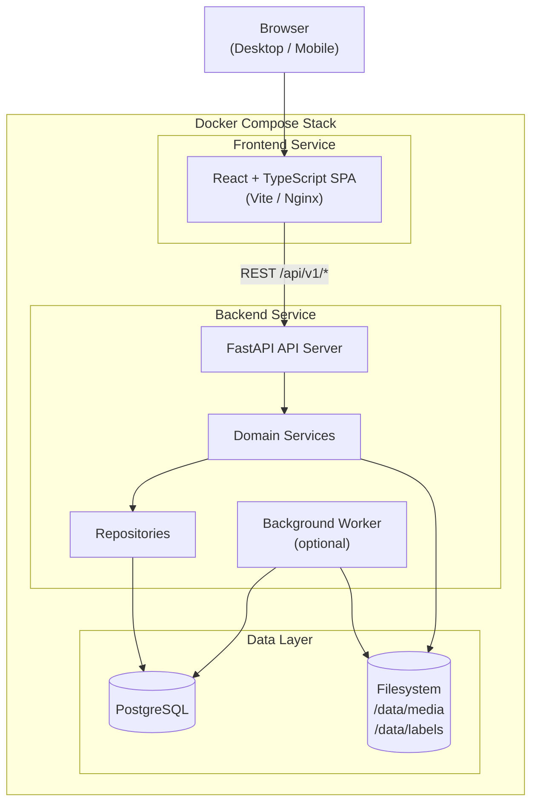
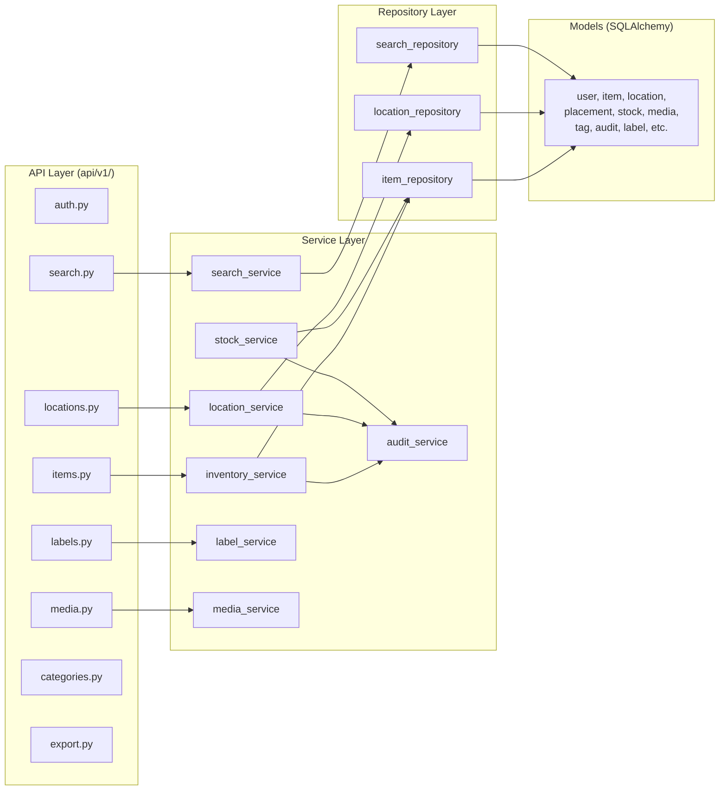
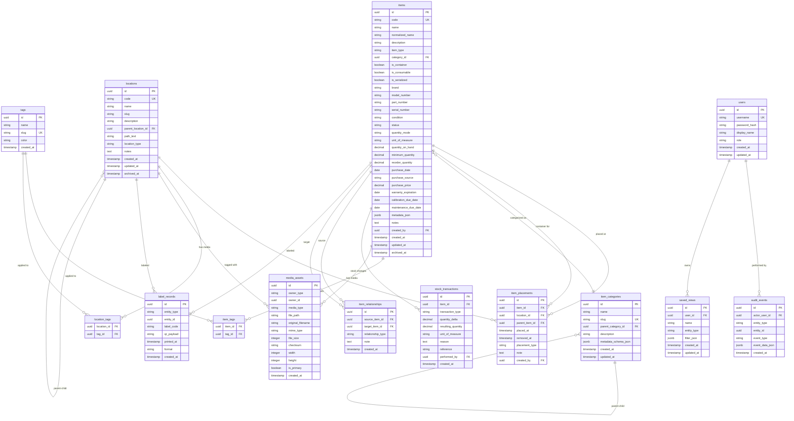

# Design Document: Inventory, Storage, and Asset Catalog System

## Overview

This design describes a self-hosted inventory, storage, and asset catalog system built as a modular monolith. The system enables users to catalog, organize, locate, and track personally owned items across hierarchical storage locations and portable containers. It supports consumable stock tracking, equipment lifecycle management, QR label generation and scanning, flexible metadata via category templates, media attachments, full-text and fuzzy search, audit trails, and bulk import/export.

The system is deployed via Docker Compose and accessed over a local network from desktop and mobile browsers.

### Technology Stack

| Layer | Technology |
|-------|-----------|
| Backend | Python 3.11+, FastAPI, SQLAlchemy 2.x, Alembic, Pydantic v2 |
| Frontend | React 18+, TypeScript, Vite, shadcn/ui, TanStack Query, TanStack Table, React Router |
| Database | PostgreSQL 15+ |
| File Storage | Local filesystem (abstracted for future S3/MinIO) |
| Deployment | Docker Compose (frontend, backend, postgres, optional worker, optional reverse proxy) |
| QR/Labels | python-qrcode, ReportLab (PDF generation) |
| Search | PostgreSQL full-text search + trigram fuzzy matching (pg_trgm) |

### Key Design Decisions

1. **Modular monolith** over microservices for simplicity, debuggability, and lower deployment overhead.
2. **Containers as items** with `is_container = true` rather than a separate entity type, keeping the model unified.
3. **Explicit placement history** via `item_placements` table rather than storing only current location.
4. **Relational core + JSONB metadata** for extensibility without constant schema changes.
5. **Stable short codes** on items and locations that are never recycled, ensuring physical labels remain valid indefinitely.
6. **API-first design** with versioned REST endpoints (`/api/v1/`) and OpenAPI documentation.
7. **PostgreSQL over SQLite** for advanced search, hierarchy queries, JSONB support, and concurrent network access.

---

## Architecture

### System Architecture Diagram



### Backend Module Architecture



### Request Flow

1. Browser sends HTTP request to FastAPI backend via `/api/v1/` routes.
2. API route handler validates request using Pydantic schemas.
3. Handler calls the appropriate domain service.
4. Service executes business logic, calls repositories for data access, and triggers audit events.
5. Repository executes SQLAlchemy queries against PostgreSQL.
6. Response is serialized via Pydantic and returned as JSON.

---

## Components and Interfaces

### Backend Components

#### API Layer (`api/v1/`)

Each module exposes FastAPI router endpoints:

| Module | Responsibility | Key Endpoints |
|--------|---------------|---------------|
| `auth.py` | Login, logout, API token management | `POST /auth/login`, `POST /auth/tokens`, `DELETE /auth/tokens/{id}` |
| `items.py` | Item CRUD, move, stock adjust, relationships | `GET/POST /items`, `GET/PATCH/DELETE /items/{id}`, `POST /items/{id}/move`, `POST /items/{id}/adjust-stock` |
| `locations.py` | Location CRUD, contents, tree | `GET/POST /locations`, `GET/PATCH /locations/{id}`, `GET /locations/{id}/contents`, `GET /locations/{id}/tree` |
| `search.py` | Global and advanced search | `GET /search`, `POST /search/advanced` |
| `labels.py` | Label generation, scan resolution | `POST /labels/generate`, `GET /scan/{code}`, `GET /entities/by-code/{code}` |
| `media.py` | File upload, retrieval, deletion | `POST /media/upload`, `GET /media/{id}`, `DELETE /media/{id}` |
| `categories.py` | Category CRUD | `GET/POST /categories`, `PATCH /categories/{id}` |
| `export.py` | Import/export operations | `POST /export/json`, `POST /export/csv`, `POST /import/csv` |

#### Service Layer

| Service | Responsibility |
|---------|---------------|
| `inventory_service` | Item creation (with short code generation, duplicate detection), update, archive, delete, movement, relationship management |
| `location_service` | Location CRUD, hierarchy management, path_text computation, circular reference prevention, tree traversal |
| `stock_service` | Stock transaction recording, quantity_on_hand updates, low-stock detection |
| `search_service` | Full-text search, structured filtering, fuzzy matching, result grouping |
| `label_service` | QR code generation, PDF label rendering, short code resolution |
| `media_service` | File upload validation, storage, thumbnail generation, primary photo management |
| `audit_service` | Audit event recording for all entity changes |

#### Repository Layer

| Repository | Responsibility |
|------------|---------------|
| `item_repository` | Item queries, placement queries, tag associations, relationship queries |
| `location_repository` | Location queries, hierarchy traversal, contents queries |
| `search_repository` | Search index queries, full-text and trigram queries |

### Frontend Components

#### Page Components

| Page | Responsibility |
|------|---------------|
| `Dashboard` | Overview with recent items, low-stock, maintenance due, quick-add |
| `ItemsPage` | Item list with table/grid toggle, filters, sorting, bulk actions |
| `ItemDetailPage` | Full item view with all sections (photos, metadata, history, etc.) |
| `LocationsPage` | Location explorer with tree sidebar and contents panel |
| `LocationDetailPage` | Location detail with contents, breadcrumbs, metadata |
| `ScanPage` | QR camera scan and manual code entry |
| `LabelCenter` | Label generation, reprint, batch printing |
| `SettingsPage` | Categories, users, backup/export, API tokens, preferences |

#### Shared Components

| Component Group | Contents |
|----------------|----------|
| `items/` | ItemCard, ItemForm, ItemTable, StockAdjustDialog, MoveDialog |
| `locations/` | LocationTree, LocationBreadcrumb, ContentsPanel |
| `search/` | GlobalSearchBar, FilterSidebar, SearchResults |
| `labels/` | LabelPreview, ScanInput, QRScanner |
| `media/` | PhotoUpload, PhotoGallery, FileList |
| `ui/` | Shared shadcn/ui primitives |

#### Key Hooks

| Hook | Purpose |
|------|---------|
| `useItems` | Item CRUD operations via TanStack Query |
| `useLocations` | Location CRUD and tree operations |
| `useSearch` | Debounced search with TanStack Query |
| `useScan` | QR scan resolution |
| `useStockAdjust` | Stock transaction mutations |

### Key Interfaces

#### Short Code Generation

```
generate_short_code(entity_type: "ITM" | "LOC") -> str
```
Generates a unique, stable, human-friendly code like `ITM-2F4K9Q` or `LOC-A93K2M`. Codes are never recycled.

#### Scan Resolution

```
resolve_code(code: str) -> { entity_type: str, entity_id: UUID, archived: bool }
```
Resolves a short code to its entity, including archived entities.

#### Placement Resolution

```
get_current_placement(item_id: UUID) -> Placement | None
```
Returns the most recent `item_placements` record where `removed_at IS NULL`.

#### Path Computation

```
compute_path_text(location_id: UUID) -> str
```
Walks the parent chain to build a path like `House > Garage > Shelf A > Bin 3`.

---

## Data Models

### Entity Relationship Diagram



### Key Data Constraints

- **Item identity**: UUID primary key + unique `code` (short code). Both are immutable after creation.
- **Placement rule**: Each `item_placements` row must have either `location_id` or `parent_item_id` set, never both null.
- **Current placement**: Determined by the most recent row where `removed_at IS NULL`.
- **Location hierarchy**: `parent_location_id` self-referencing FK. `path_text` is a denormalized computed field recomputed on parent changes.
- **No circular locations**: The system validates that setting a parent does not create a cycle.
- **No self-containment**: A container cannot be placed inside itself (directly or transitively).
- **Short code stability**: Codes are never recycled or reassigned, even for archived/deleted entities.
- **Normalized name**: `normalized_name` is a lowercased, accent-stripped version of `name` for case-insensitive search.
- **JSONB fields**: `metadata_json` (items), `metadata_schema_json` (categories), `event_data_json` (audit), `filter_json` (saved views) use PostgreSQL JSONB for flexible semi-structured data.

### Search Indexing

- PostgreSQL `tsvector` column on items combining: name, description, notes, brand, model_number, part_number, serial_number.
- `pg_trgm` extension for trigram-based fuzzy matching on item names and model numbers.
- GIN indexes on tsvector and trigram columns.
- Structured filters use standard SQL WHERE clauses on indexed columns.

